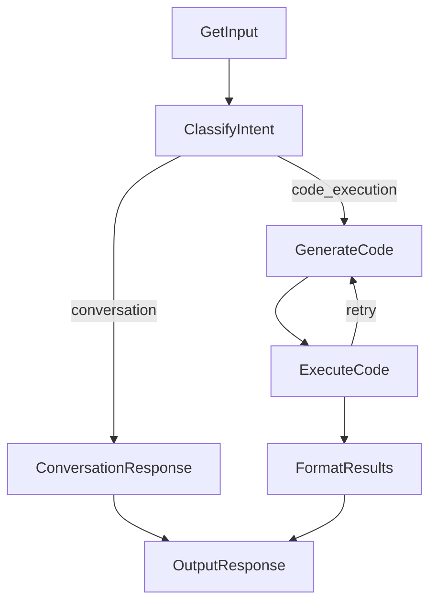

# Design Doc: Analytical Chatbot (A2A + PocketFlow + React)

This project is an educational example of wiring a chatbot UI to a remote A2A agent over gRPC, with a PocketFlow-based orchestration layer and a sandboxed Python kernel for analysis.

## Goals

- Provide a simple chat UI for data analysis.
- Run LLM-generated Python safely and return rich artifacts.
- Expose an A2A-compatible agent (HTTP/JSON-RPC + gRPC).
- Keep the UI decoupled from the agent via a REST BFF.

## High-Level Architecture

```
Browser (React)  ->  BFF REST (rest_server.py)  ->  A2A gRPC (a2a_server.py)
                                                         |
                                                         v
                                               AgentExecutor + PocketFlow
                                                         |
                                                         v
                                                Sandboxed Kernel (utils/kernel.py)
```

### Components

- **BFF REST API (`rest_server.py`)**
  - Converts UI requests into A2A gRPC messages.
  - Streams back text and artifacts (tables, plots, HTML, Mermaid).

- **A2A Backend (`a2a_server.py`, `agent_executor.py`)**
  - Hosts the A2A Agent Card and handles gRPC/HTTP requests.
  - `AnalyticalChatbotExecutor` adapts A2A events to PocketFlow.

- **PocketFlow (`utils/flow.py`, `utils/nodes.py`)**
  - Classifies intent and either responds directly or generates + executes code.
  - On execution error, re-prompts the LLM with the error to retry.

- **Sandboxed Kernel (`utils/kernel.py`, `utils/sandbox.py`)**
  - Multiprocessing worker that runs Python with a restricted namespace.
  - Emits artifacts via tags like ```table id``` or ```plot id```.

## PocketFlow

### Flow Diagram



### Node Responsibilities

- **GetInput**: normalize input and detect empty messages.
- **ClassifyIntent**: decide between chat vs. code execution.
- **ConversationResponse**: lightweight assistant response.
- **GenerateCode**: produce Python using Polars/Altair and DuckDB helpers.
- **ExecuteCode**: run in kernel and return stdout + artifacts.
- **FormatResults**: summarize results and reference artifacts by tag.
- **OutputResponse**: append to history and return response.

## Artifact Pipeline

1. The kernel registers artifacts (table/plot/html/mermaid) and prints tags.
2. The LLM response must include those tags for placement in the UI.
3. The BFF relays artifacts to the frontend, which renders them by tag type.

## Sandbox Model

- Multiprocessing kernel isolates execution from the API process.
- Safety is enforced via simple string checks and a restricted namespace.
- This is educational and intended for trusted/local use.

## Interfaces

- **BFF REST**: `/chat`, `/upload`, `/files`, `/database` for the UI.
- **A2A HTTP/JSON-RPC**: `http://localhost:8001/messages`.
- **A2A gRPC**: `localhost:50051`.

## Known Tradeoffs

- The safety guard is lightweight (string-based) and not hardened.
- Sessions are stored in-memory; restarting the server resets history.
- Artifact rendering requires the LLM to include the generated tags.
