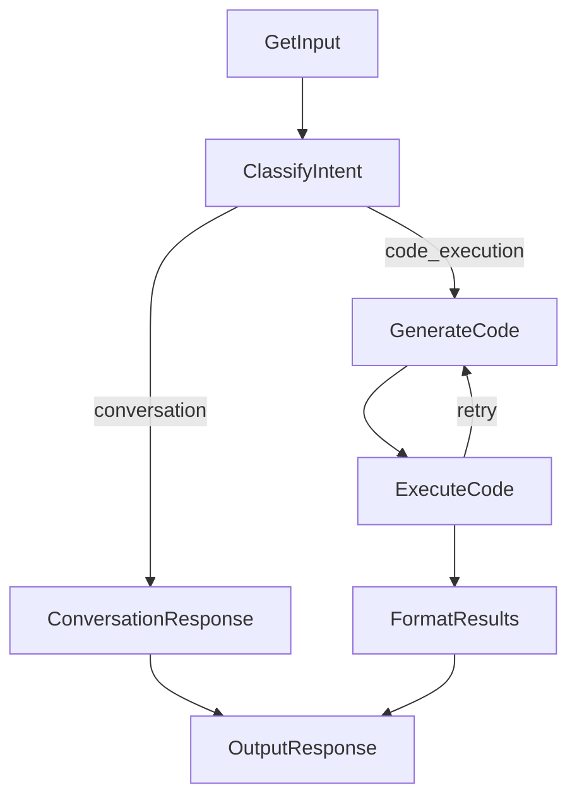

# Design Doc: Analytical Chatbot (A2A + PocketFlow + React)

This project is an educational example of wiring a chatbot UI to a remote A2A agent over gRPC, with a PocketFlow-based orchestration layer and a sandboxed Python kernel for analysis.

## Goals

- Provide a simple chat UI for data analysis.
- Run LLM-generated Python safely and return rich artifacts.
- Expose an A2A-compatible agent (HTTP/JSON-RPC + gRPC).
- Keep the UI decoupled from the agent via a REST BFF.

## High-Level Architecture

```
Browser (React)  ->  BFF REST (rest_server.py)  ->  A2A gRPC (a2a_server.py)
                                                         |
                                                         v
                                               AgentExecutor + PocketFlow
                                                         |
                                                         v
                                                Sandboxed Kernel (Docker or multiprocessing)
```

### Components

- **BFF REST API (`rest_server.py`)**
  - Converts UI requests into A2A gRPC messages.
  - Streams back text and artifacts (tables, plots, HTML, Mermaid).

- **A2A Backend (`a2a_server.py`, `agent_executor.py`)**
  - Hosts the A2A Agent Card and handles gRPC/HTTP requests.
  - `AnalyticalChatbotExecutor` adapts A2A events to PocketFlow.

- **PocketFlow (`utils/flow.py`, `utils/nodes.py`)**
  - Classifies intent and either responds directly or generates + executes code.
  - On execution error, re-prompts the LLM with the error to retry (up to 2 retries).

- **Sandbox Factory (`utils/sandbox_factory.py`)**
  - Auto-detects available backends and selects the best one.
  - Supports Docker (via llm-sandbox) and multiprocessing backends.

- **Docker Sandbox (`utils/llm_sandbox_kernel.py`)**
  - Full container isolation using the llm-sandbox library.
  - Pre-installs data science libraries (pandas, numpy, polars, altair, etc.).
  - Supports pre-built images for fast startup.

- **Multiprocessing Sandbox (`utils/kernel.py`, `utils/sandbox.py`)**
  - Process-based isolation with restricted namespace.
  - Faster startup, suitable for development and trusted environments.

## PocketFlow

### Flow Diagram



### Node Responsibilities

- **GetInput**: normalize input and detect empty messages.
- **ClassifyIntent**: decide between chat vs. code execution.
- **ConversationResponse**: lightweight assistant response.
- **GenerateCode**: produce Python using Polars/Altair and DuckDB helpers.
- **ExecuteCode**: run in kernel and return stdout + artifacts.
- **FormatResults**: summarize results and reference artifacts by tag.
- **OutputResponse**: append to history and return response.

### Error Handling and Retry Logic

When code execution fails, the system automatically retries:

1. **ExecuteCodeNode** detects failure and stores the error in `shared["last_error"]`
2. Returns `"retry"` to route back to **GenerateCodeNode** (up to 2 retries)
3. **GenerateCodeNode** includes the error in the prompt with explicit fix guidance
4. The LLM regenerates code with awareness of the previous error

The retry prompt includes common Polars API fixes:
- `with_column()` -> `with_columns()` (Polars 0.19+ breaking change)
- `groupby()` -> `group_by()`
- Decimal type casting for Altair charts

Logging tracks the retry flow:
```
[EXECUTE] Code execution FAILED (attempt 1/3)
[EXECUTE] Error: AttributeError: 'DataFrame' object has no attribute 'with_column'...
[EXECUTE] Routing back to GenerateCodeNode for retry #1
[GENERATE] Retrying code generation with error feedback...
[GENERATE] Code regenerated (retry #1)
[EXECUTE] Code execution succeeded
```

## Sandbox Architecture

### Backend Selection

The `sandbox_factory.py` module auto-detects and creates the best available backend:

```python
from utils.sandbox_factory import create_sandbox

kernel = create_sandbox()  # Auto-detects best backend
print(f"Using: {kernel.backend_name}")  # "docker" or "multiprocessing"
```

### Environment Variables

| Variable | Description | Default |
|----------|-------------|---------|
| `SANDBOX_FORCE_BACKEND` | Force `docker` or `multiprocessing` | Auto-detect |
| `SANDBOX_PREFER_DOCKER` | Prefer Docker when available | `true` |
| `SANDBOX_TIMEOUT` | Execution timeout in seconds | `30` |
| `SANDBOX_DOCKER_IMAGE` | Custom Docker image | Default Python image |
| `SANDBOX_SKIP_INSTALL` | Skip pip install in container | Auto-detect from image name |

### Docker Backend (llm-sandbox)

Uses the `llm-sandbox` library to run code in isolated Docker containers:

```python
from llm_sandbox import SandboxSession, SandboxBackend

session = SandboxSession(
    lang="python",
    backend=SandboxBackend.DOCKER,
    keep_template=True  # Reuse container for session
)
```

**Pre-built Image for Fast Startup:**

Building a custom image eliminates the ~30-60s pip install time:

```bash
./docker/build-sandbox-image.sh
export SANDBOX_DOCKER_IMAGE=analytical-chatbot-sandbox:latest
```

The image is auto-detected by name pattern (`analytical-chatbot-sandbox`, `sandbox-prebuilt`, etc.) and skips library installation.

### Multiprocessing Backend

Uses Python's multiprocessing module with a restricted namespace:

- Blocks dangerous modules: `os`, `sys`, `subprocess`, `socket`, etc.
- Blocks dangerous builtins: `exec`, `eval`, `compile`, `open`, etc.
- Enforces CPU time limits via `resource.setrlimit`

## Artifact Pipeline

1. The kernel registers artifacts (table/plot/html/mermaid) and prints tags.
2. The LLM response must include those tags for placement in the UI.
3. The BFF relays artifacts to the frontend, which renders them by tag type.

### Artifact Types

| Type | Content | Rendering |
|------|---------|-----------|
| `plot` | Base64 SVG | Inline image |
| `table` | HTML table | Styled table |
| `html` | Raw HTML | Iframe or inline |
| `mermaid` | Mermaid syntax | Diagram renderer |
| `markdown` | Markdown text | Markdown renderer |

## Interfaces

- **BFF REST**: `/chat`, `/upload`, `/files`, `/database` for the UI.
- **A2A HTTP/JSON-RPC**: `http://localhost:8001/messages`.
- **A2A gRPC**: `localhost:50051`.

## Logging

The system provides comprehensive logging for debugging:

### Sandbox Factory Logs
```
[SANDBOX] ============================================
[SANDBOX] Creating sandbox instance...
[SANDBOX] SANDBOX_FORCE_BACKEND=docker -> forcing 'docker' backend
[SANDBOX] Docker daemon is running and accessible
[SANDBOX] llm-sandbox library is installed (version: X.X.X)
[SANDBOX] SUCCESS: Using Docker backend via llm-sandbox (FORCED)
```

### Docker Sandbox Logs
```
[DOCKER-SANDBOX] Starting Docker sandbox session...
[DOCKER-SANDBOX] Creating SandboxSession with: backend=DOCKER, lang=python
[DOCKER-SANDBOX] Docker sandbox session started successfully!
[DOCKER-SANDBOX] ========== Execution #1 ==========
[DOCKER-SANDBOX] Executing code in Docker container...
[DOCKER-SANDBOX] Execution #1 completed: success=True, exit_code=0
```

### Code Generation Logs
```
[GENERATE] Generating code (first attempt)
[EXECUTE] Code execution FAILED (attempt 1/3)
[EXECUTE] Routing back to GenerateCodeNode for retry #1
[GENERATE] Retrying code generation with error feedback...
```

## Known Tradeoffs

- The multiprocessing safety guard is lightweight (string-based) and not hardened.
- Sessions are stored in-memory; restarting the server resets history.
- Artifact rendering requires the LLM to include the generated tags.
- Docker backend has startup latency (mitigated by pre-built images).
- Each Docker code execution gets a fresh interpreter (no persistent namespace).
