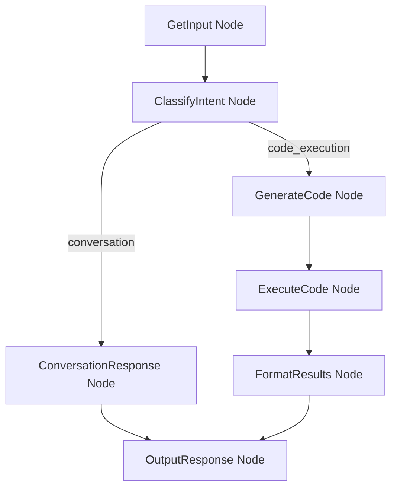

# Design Doc: Analytical Chatbot with Code Execution

> A web-based chatbot using PocketFlow with analytical capabilities and sandboxed Python code execution.

## Requirements

### User Stories

1. **As a user**, I want to chat with an AI assistant that can answer questions conversationally.
2. **As a user**, I want to ask analytical questions and have the bot generate and execute Python code to answer them.
3. **As a user**, I want to see the generated code before it runs, along with execution results.
4. **As a user**, I want code execution to be safe (sandboxed) so malicious code cannot harm my system.
5. **As a user**, I want to upload data files (CSV, JSON) for analysis.

### Functional Requirements

- Web-based chat interface with message history
- Intent classification: determine if user wants code execution or just conversation
- Python code generation for analytical tasks
- Sandboxed code execution using RestrictedPython
- Support for common data analysis libraries (pandas, numpy, matplotlib)
- File upload capability for data analysis
- Display of code, output, and any generated plots

### Non-Functional Requirements

- Safe execution: prevent file system access, network calls, imports of dangerous modules
- Timeout: kill long-running code after 30 seconds
- Memory limit: prevent memory exhaustion attacks

## Flow Design

### Applicable Design Patterns

1. **Agent Pattern**: The chatbot decides whether to execute code or respond conversationally based on user intent.
2. **Workflow Pattern**: Sequential processing of user input through classification, code generation, execution, and response formatting.

### Flow High-Level Design



### Node Descriptions

1. **GetInput Node**: Receives user message and any uploaded files from the web interface.
2. **ClassifyIntent Node**: Uses LLM to classify if the user wants:
   - `conversation`: General chat, greetings, clarifications
   - `code_execution`: Data analysis, calculations, visualizations
3. **ConversationResponse Node**: Generates a conversational response using LLM.
4. **GenerateCode Node**: Generates Python code to answer the analytical question.
5. **ExecuteCode Node**: Runs the generated code in a sandboxed environment.
6. **FormatResults Node**: Formats execution results (stdout, errors, plots) for display.
7. **OutputResponse Node**: Combines all outputs into final response for the user.

## Utility Functions

### 1. Call LLM (`utils/call_llm.py`)
- **Input**: `prompt` (str), `system_prompt` (str, optional)
- **Output**: `response` (str)
- **Necessity**: Used by ClassifyIntent, ConversationResponse, GenerateCode nodes

### 2. Execute Sandboxed Code (`utils/sandbox.py`)
- **Input**: `code` (str), `context` (dict) - contains uploaded data
- **Output**: `{"stdout": str, "stderr": str, "plots": list[str], "success": bool}`
- **Necessity**: Used by ExecuteCode node to safely run generated Python code
- **Security Features**:
  - RestrictedPython for AST-level code restrictions
  - Whitelist of allowed imports (pandas, numpy, math, statistics)
  - No file system access
  - No network access
  - Execution timeout (30 seconds)
  - Capture matplotlib plots as base64 images

### 3. Parse Code Block (`utils/parse_code.py`)
- **Input**: `llm_response` (str)
- **Output**: `code` (str)
- **Necessity**: Extracts Python code from LLM response (handles ```python blocks)

## Node Design

### Shared Store

```python
shared = {
    # Input
    "user_message": str,              # Current user message
    "uploaded_files": {               # Uploaded file data
        "filename.csv": pd.DataFrame,
        ...
    },
    "chat_history": [                 # Conversation history
        {"role": "user", "content": "..."},
        {"role": "assistant", "content": "..."},
        ...
    ],

    # Processing
    "intent": str,                    # "conversation" or "code_execution"
    "generated_code": str,            # Python code if applicable
    "execution_result": {             # Code execution output
        "stdout": str,
        "stderr": str,
        "plots": [str],               # Base64 encoded plot images
        "success": bool
    },

    # Output
    "response": {
        "message": str,               # Text response to user
        "code": str | None,           # Code shown to user (if applicable)
        "output": str | None,         # Code output (if applicable)
        "plots": [str] | None,        # Plot images (if applicable)
        "error": str | None           # Error message (if applicable)
    }
}
```

### Node Steps

#### 1. GetInput Node
- **Purpose**: Initialize shared store with user input
- **Type**: Regular Node
- **Steps**:
  - *prep*: Read from web request (passed via params or shared)
  - *exec*: No computation needed
  - *post*: Store `user_message` and `uploaded_files` in shared

#### 2. ClassifyIntent Node
- **Purpose**: Determine if user wants code execution or conversation
- **Type**: Regular Node (with retry)
- **Steps**:
  - *prep*: Read `user_message` and `chat_history` from shared
  - *exec*: Call LLM with classification prompt, parse YAML response
  - *post*: Store `intent` in shared, return intent as action

#### 3. ConversationResponse Node
- **Purpose**: Generate conversational response for non-code queries
- **Type**: Regular Node (with retry)
- **Steps**:
  - *prep*: Read `user_message` and `chat_history` from shared
  - *exec*: Call LLM to generate friendly response
  - *post*: Store response in `shared["response"]["message"]`, return "output"

#### 4. GenerateCode Node
- **Purpose**: Generate Python code for analytical tasks
- **Type**: Regular Node (with retry)
- **Steps**:
  - *prep*: Read `user_message`, `uploaded_files` metadata, `chat_history`
  - *exec*: Call LLM with code generation prompt, extract code block
  - *post*: Store `generated_code` in shared, return "default"

#### 5. ExecuteCode Node
- **Purpose**: Run generated code in sandbox
- **Type**: Regular Node
- **Steps**:
  - *prep*: Read `generated_code` and `uploaded_files` from shared
  - *exec*: Call sandbox executor with code and data context
  - *post*: Store `execution_result` in shared, return "default"

#### 6. FormatResults Node
- **Purpose**: Format execution results for user display
- **Type**: Regular Node
- **Steps**:
  - *prep*: Read `generated_code`, `execution_result`, `user_message`
  - *exec*: Call LLM to generate explanation of results
  - *post*: Populate `shared["response"]` with code, output, plots, message

#### 7. OutputResponse Node
- **Purpose**: Finalize response and update chat history
- **Type**: Regular Node
- **Steps**:
  - *prep*: Read `response` from shared
  - *exec*: No computation
  - *post*: Append to `chat_history`, prepare final response

## Web Interface Design

### Backend (Flask)
- `POST /chat`: Receive user message, run flow, return response
- `POST /upload`: Handle file uploads, store in session
- `GET /`: Serve chat interface

### Frontend (HTML/CSS/JS)
- Chat message display with markdown rendering
- Code block syntax highlighting
- Plot image display
- File upload drag-and-drop
- Loading indicators during processing

## Security Considerations

### Sandboxed Execution
1. **RestrictedPython**: Compile code with restricted AST transformations
2. **Import Whitelist**: Only allow safe modules (pandas, numpy, math, etc.)
3. **No Builtins**: Remove dangerous builtins (open, exec, eval, __import__)
4. **Timeout**: Use signal/threading to kill long-running code
5. **Output Capture**: Redirect stdout/stderr to string buffers
6. **Plot Capture**: Intercept matplotlib and save to memory buffer

### Input Validation
- Limit message length
- Limit file size and types
- Sanitize filenames

## File Structure

```
chatbot/
├── main.py                 # Entry point, Flask app
├── nodes.py                # All node definitions
├── flow.py                 # Flow creation and orchestration
├── utils/
│   ├── __init__.py
│   ├── call_llm.py         # LLM wrapper
│   ├── sandbox.py          # Sandboxed code execution
│   └── parse_code.py       # Code extraction from LLM response
├── static/
│   ├── style.css           # Chat interface styles
│   └── app.js              # Frontend JavaScript
├── templates/
│   └── index.html          # Chat interface template
├── requirements.txt        # Python dependencies
└── docs/
    └── design.md           # This document
```

## Dependencies

```
pocketflow
flask
openai  # or anthropic, google-generativeai
pandas
numpy
matplotlib
RestrictedPython
```
